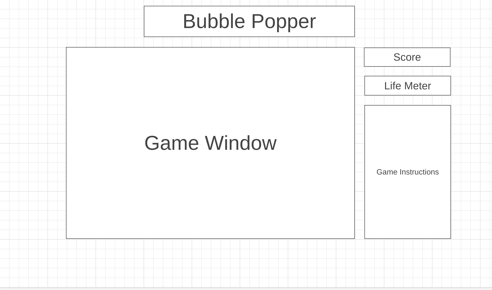

# Balloon Popper  
  
The game is set within a window, featuring balloons ascending from the bottom. Every balloon displays a randomly assigned letter. To pop a balloon, you must accurately type the corresponding letter on your keyboard. However, if you mistype, not only do you lose points, but the balloon also persists. You start the game with three lives. Losing a life occurs when a balloon reaches the top of the window. As you successfully pop more balloons, the game intensifies with increased balloon speed.

[Play Game.](https://mujahed-a1i.github.io/Balloon-Popper)

## Gameplay
The game website will open with an instruction modal. To start the game will need to click the Start button on the instruction modal. At the end of the game, a game stats modal will appear. If you would like to play again, you can click on the New Game button. To restart the game, you click on the restart button. If you need to read the instructions again, you can click on the help button. After clicking on the help button the game will pause. The game will resume once you close the instructions modal.
 


## Implementation
**Balloon Movement**  
A Balloon class will draw an image of a balloon within the canvas window. The balloon color will randomly selected from an array of balloon images. Within the balloon class, there will be movement functions that will allow the balloon to float up, right and left. Each balloon directions will be random and have a random movement limit. Once the movement limit is reached, the balloon will randomly generate another direction. If the balloon hits the side of the screen, it will bounce back to the other direction. If the the balloon reaches to the top, it will pop. 

```javascript
  //balloon.js
  draw() { // Draws the balloon with corresponding Letter
    this.ctx.drawImage(this.image,this.x, this.y, this.image.width, this.image.height);
    // Draws the corresponding letter within the balloon
    this.ctx.fillStyle = 'white'; // Set the color for the text
    this.ctx.font = '25px Arial'; // Set the font style
    this.ctx.textAlign = 'center';
    this.ctx.textBaseline = 'middle';
    this.ctx.fillText(this.letter, this.x + 27, this.y + 30);
  }

  floatRight() { // Balloon direction to NE
    this.x+= this.dx;
    this.y-= this.dy * Balloon.dy;
  }

  floatLeft(){ // Balloon direction to NW
    this.x-= this.dx;
    this.y-= this.dy * Balloon.dy;
  }

  floatUp(){ // Balloon direction to N
    this.y-= this.dy * Balloon.dy;
```
**Balloon Pop**  
In the game class, the will be a keyboard event listener. In this event listener the game will recognize alphabetical keystrokes. If the keystroke's letter match a balloon's letter, the balloon will pop and increment the score. If the keystroke does not match you will lose a point.  
```javascript
pop(event) {
    if (event.keyCode > 64 && event.keyCode < 91) {
      // checking to see if the keypress is only alphabetical chars
      let correctKeyPress = false;
      for (let i = 0; i < this.canvas.balloons.length; i++) {
        let balloon = this.canvas.balloons[i];
        if (event.key.toUpperCase() === balloon.letter) {
          // if the keypress matches the balloon's letter
          // the balloon will be removed from the array
          // Once 1 balloon is removed, another one is being added.
          this.canvas.balloons.splice(i, 1);
          this.score++;
          this.gameScore.textContent = `Score: ${this.score}`;
          this.canvas.addBalloon();
          this.balloonCount++;
          correctKeyPress = true;
          // Break after the first matching balloon is removed
          this.popCounter++;
          this.gamePopCounter.textContent = `Balloons Popped: ${this.popCounter}`;
          break; 
        } 
      }

      if (!correctKeyPress) {
        this.score--;
        this.gameScore.textContent = `Score: ${this.score}`;
        this.missed++;
      }
    }
```

**Increase Game Difficulty**  
After every 10th point, the difficulty will increase. The speed of the balloons will increase by .15% 
```javascript
 increaseBalloonSpeed(){
    if (this.score > 0 && this.score % 10 === 0) {
      Balloon.dy *= 1.0015;
    }
  }
```
<!-- ## Wireframe  
 -->

## Future Implementaion
- Add a moving cloud. The moving cloud will have collision detection with balloons in which you will not be able to pop the balloons.
- Add High Score History
- Add game music and popping sound when a balloon pops.

<!-- In addition, this project will include:  
- A production README -->

  
## Technologies, Libraries, APIs
- The Canvas API to render the game window and objects pertaining in the window
- Webpack bundle and transpile the source JavaScript code
- NPM to manage project dependencies
<!-- 
## Implementation Timeline  
- Thursday & Friday: Setup the project by getting webpack operational. Ensuring the canvas window and balloons appears on the screen, and familiarize myself with the Canvas API
- Weekend: Implementing the game rules to Balloon Popper and adding player controls
- Monday: Implementing color schemes through CSS -->


