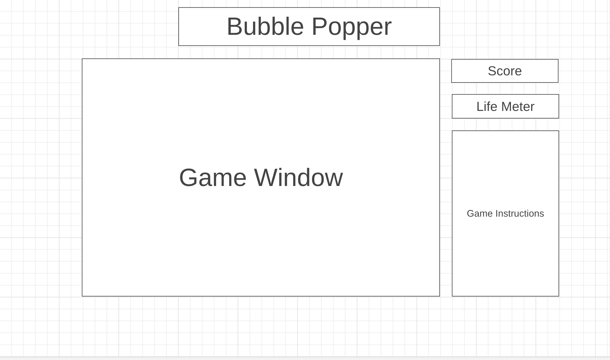

# Balloon Popper  
  
The game is set within a window, featuring balloons ascending from the bottom. Every balloon displays a randomly assigned letter. To burst a balloon, you must accurately type the corresponding letter on your keyboard. However, if you mistype, not only do you lose points, but the balloon also persists. You start the game with three lives.Losing a life occurs when a balloon reaches the top of the window. As you successfully pop more balloons, the game intensifies with increased balloon speed and a higher volume of balloons appearing in the window.
  
## Wireframe  

## Functionality & MVPs  
In Ballon Popper, players will be able to:  

- Keyboard Interaction: To burst a balloon, players must type the corresponding letter accurately.  
- Life System Bar: Players start with three lives
- Score Display: Displays the current score of how many balloons were popped
- Mistyping Penalty: Mistyping results in a loss of points and the balloon persists.

In addition, this project will include:  
- A production README

  
## Technologies, Libraries, APIs
- The Canvas API to render the game window and objects pertaining in the window
- Webpack bundle and transpile the source JavaScript code
- npm to manage project dependencies

## Implementation Timeline  
- Thursday & Friday: Setup the project by getting webpack operational. Ensuring the canvas window and balloons appears on the screen, and familiarize myself with the Canvas API
- Weekend: Implementing the game rules to Bubble Popper and adding player controls
- Monday: Implementing color schemes through CSS

